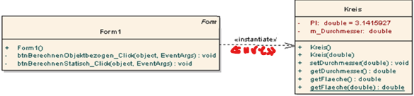

# Klassendiagramme

## Die lose Beziehung

### Typ 1 «instanziiert»
Wenn wir ein Objekt erstellen, welches ein anderes Objekt verwendet, ohne dessen Referenz als Membervariable zu speichern, handelt es sich um eine lose «inszanziiert» Beziehung.

### Typ 2 «use»
Wenn wir auf ein statisches Element einer anderen Klasse zugreifen, handelt es sich um eine lose «use» Beziehung.

## Assoziationsbeziehung
Prinzipiell sprechen wir von einer Assoziationsbeziehung, wenn ein Objekt einer Klasse, eine Referenz (die Speicherstelle eines anderen Objektes) als Membervariable speichert.

### Kategoresierungsgesichtspunkte
Nach ihrer Richtung: 
*	unidirektionale (gerichtete) Assoziation
*	bidirektionale Assoziation

Nach der Mengenangabe:
*	1:1-Assoziation (ein Objekt kann ein anderes Objekt referenzieren)
*	1:n-Assoziation (ein Objekt kann ein oder mehrere andere Objekte referenzieren)
*	N:m-Assoziation (Objekte können sich gegenseitig mehrfach referenzieren)

Nach der Wirkung:
*	Assoziation
*	Aggregation (Spezialfall der Assoziation)
*	Komposition (Spezialfall der Aggregation)
